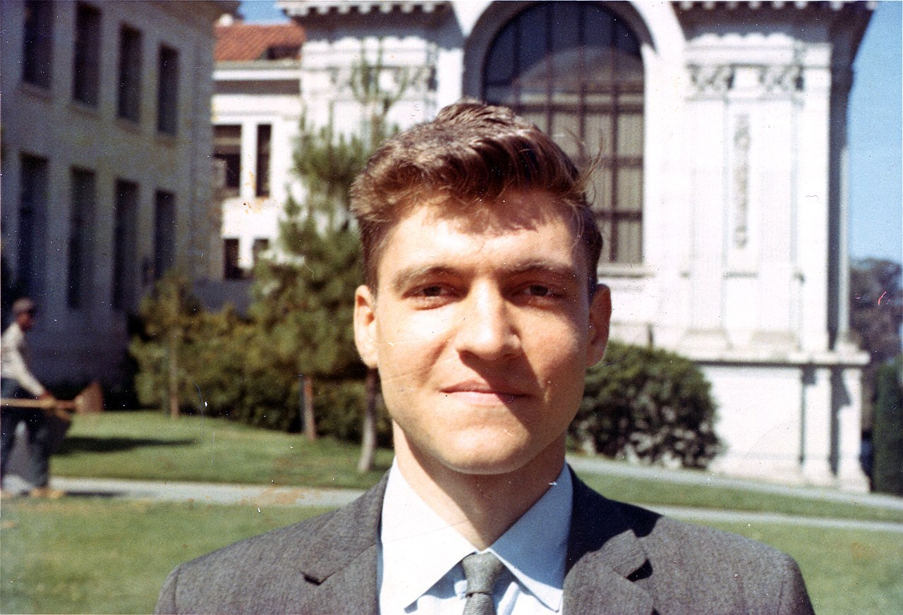

<table class="infobox biography vcard">
<tbody>
<tr>
<td colspan="2">
</td>

</tr>
<tr>
<th scope="row">Nascido</th>
<td>

Theodore John Kaczynski

 22 de Maio de 1942&nbsp;(age&nbsp;81) 

<a title="Chicago" href="https://pt.wikipedia.org/wiki/Chicago">Chicago, Illinois</a>, EUA

</td>
</tr>

<tr>
<th scope="row">Nacionalidade</th>
<td class="category">Americano</td>
</tr>

<tr>
<th scope="row">Conhecido&nbsp;por</th>
<td>

<ul>
<li><em><a title="A Sociedade Industrial e Seu Futuro" href="https://en-wikipedia-org.translate.goog/wiki/Industrial_Society_and_Its_Future?_x_tr_sl=en&_x_tr_tl=pt&_x_tr_hl=pt&_x_tr_pto=tc">A Sociedade Industrial e Seu Futuro</a></em></li>
</ul>

</td>
</tr>

<tr>
<th scope="row">Formação</th>
<td>

<ul>

<li><a title="Universidade Harvard" href="https://pt.wikipedia.org/wiki/Universidade_Harvard">Universidade Harvard</a>&nbsp;(1958-1962)</li>
<li><a title="Universidade de Michigan" href="https://pt.wikipedia.org/wiki/Universidade_de_Michigan">Universidade de Michigan</a>&nbsp;(1962-1967)</li>
</ul>

</td>
</tr>

</tbody>
</table>

<ul>
 <li><a target="_blank" href="https://github.com/Jgmro/A-SOCIEDADE-INDUSTRIAL-E-SEU-FUTURO/blob/main/A%20Sociedade%20Industrial%20e%20Seu%20Futuro.pdf" style="text-decoration:none;">A Sociedade Industrial e Seu Futuro</a></li>

</ul>
